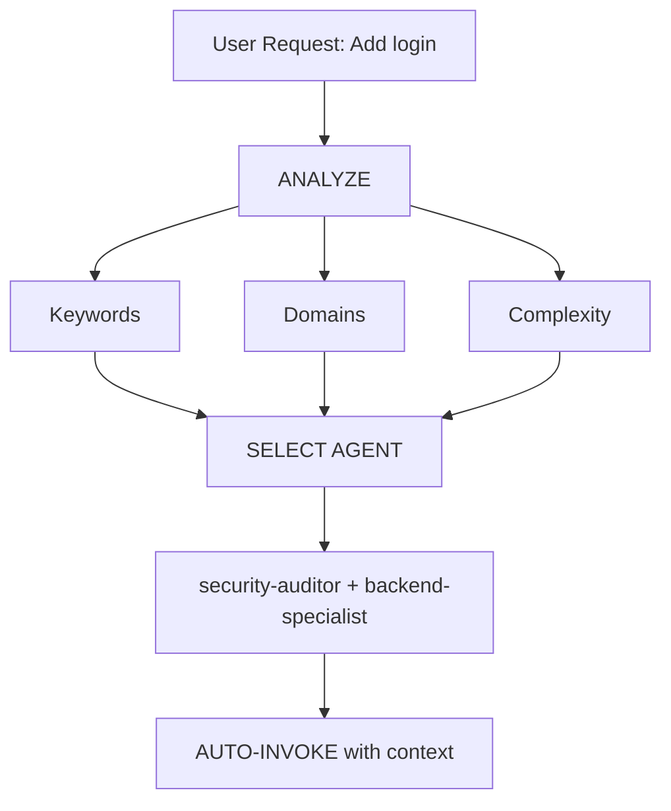

# Intelligent Agent Routing

**Purpose**: Automatically analyze user requests and route them to the most appropriate specialist agent(s) without requiring explicit user mentions.

## Core Principle

> **The AI should act as an intelligent Project Manager**, analyzing each request and automatically selecting the best specialist(s) for the job.

## How It Works

### 1. Request Analysis

Before responding to ANY user request, perform automatic analysis:



### 2. Agent Selection Matrix

**Use this matrix to automatically select agents:**

| User Intent         | Keywords (EN / PT)                                           | Selected Agent(s)                           | Auto-invoke? |
| ------------------- | ------------------------------------------------------------ | ------------------------------------------- | ------------ |
| **Authentication**  | "login", "auth", "signup", "password" / "senha", "cadastro", "autenticação" | `security-auditor` + `backend-specialist`   | ✅ YES       |
| **UI Component**    | "button", "card", "layout", "style" / "botão", "cartão", "visual", "estilo" | `frontend-specialist`                       | ✅ YES       |
| **Mobile UI**       | "screen", "navigation", "touch" / "tela", "navegação", "toque", "celular" | `mobile-developer`                          | ✅ YES       |
| **API Endpoint**    | "endpoint", "route", "API" / "rota", "servidor", "conectar front" | `backend-specialist`                        | ✅ YES       |
| **Database**        | "schema", "query", "table" / "banco de dados", "tabela", "estrutura" | `database-architect` + `backend-specialist` | ✅ YES       |
| **Bug Fix**         | "error", "bug", "broken" / "erro", "quebrado", "não funciona", "bug" | `debugger`                                  | ✅ YES       |
| **Test**            | "test", "coverage", "unit" / "testar", "validar", "cobertura", "testes" | `test-engineer`                             | ✅ YES       |
| **Deployment**      | "deploy", "CI/CD", "docker" / "publicar", "colocar no ar", "subir site" | `devops-engineer`                           | ✅ YES       |
| **Security Review** | "security", "vulnerability" / "seguro", "vulnerabilidade", "ataque" | `security-auditor` + `penetration-tester`   | ✅ YES       |
| **Performance**     | "slow", "optimize", "speed" / "lento", "rápido", "otimizar", "velocidade" | `performance-optimizer`                     | ✅ YES       |
| **Product Def**     | "requirements", "MVP" / "requisitos", "ideia", "funcionalidades" | `product-owner`                             | ✅ YES       |
| **Kit Health**      | "doctor", "diagnóstico", "checar kit" / "saúde", "integridade", "tá tudo certo" | *(scripts)* `doctor.py`                      | ✅ YES       |
| **ADE Pipeline**    | "/ade", "pipeline autônomo" / "fazer tudo", "implementar autônomo" | `orchestrator` via `/ade`                   | ✅ YES       |
| **Memory Layer**    | "lessons", "gotchas", "memory" / "lições", "aprendemos", "evitar erro" | Consultar `.agent/memory/`                  | ✅ YES       |
| **Premium Design** | "premium design", "immersive", "awwwards", "gsap", "three.js" / "site premiado", "design de luxo", "animações premium", "interface imersiva", "5 pilares", "experiência imersiva", "design premium" | `frontend-specialist` + `premium-design-orchestrator` | ✅ YES       |
| **Brand Extraction** | "extract identity", "clone design", "analyze reference" / "extrair identidade", "clonar design", "analisar referência", "extrair paleta", "copiar essência" | `brand-identity-extractor` | ✅ YES       |

### 3. Automatic Routing Protocol

## TIER 0 - Automatic Analysis (ALWAYS ACTIVE)

Before responding to ANY request:

```javascript
// Pseudo-code for decision tree
function analyzeRequest(userMessage) {
    // 1. Classify request type
    const requestType = classifyRequest(userMessage);

    // 2. Detect domains
    const domains = detectDomains(userMessage);

    // 3. Determine complexity
    const complexity = assessComplexity(domains);

    // 4. Select agent(s)
    if (complexity === "SIMPLE" && domains.length === 1) {
        return selectSingleAgent(domains[0]);
    } else if (complexity === "MODERATE" && domains.length <= 2) {
        return selectMultipleAgents(domains);
    } else {
        return "orchestrator"; // Complex task
    }
}
```

## 4. Response Format

**When auto-selecting an agent, inform the user concisely:**

```markdown
🤖 **Applying knowledge of `@security-auditor` + `@backend-specialist`...**

[Proceed with specialized response]
```

**Benefits:**

- ✅ User sees which expertise is being applied
- ✅ Transparent decision-making
- ✅ Still automatic (no /commands needed)

## Domain Detection Rules

### Single-Domain Tasks (Auto-invoke Single Agent)

| Domain          | Patterns (EN + PT natural language)                                                  | Agent                   |
| --------------- | ------------------------------------------------------------------------------------ | ----------------------- |
| **Security**    | auth, login, jwt, password, hash, token, "tá seguro?", "pode ser hackeado?", "verificar segurança", "proteger dados" | `security-auditor` |
| **Frontend**    | component, react, vue, css, html, tailwind, "deixa mais bonito", "muda o visual", "tá feio", "redesign", "interface moderna", "mudar cor", "dark mode", "modo escuro" | `frontend-specialist` |
| **Backend**     | api, server, express, fastapi, node, "criar endpoint", "conectar com", "rota", "servidor", "API" | `backend-specialist` |
| **Mobile**      | react native, flutter, ios, android, expo, "app mobile", "app para celular", "tela do celular" | `mobile-developer` |
| **Database**    | prisma, sql, mongodb, schema, migration, "banco de dados", "tabela", "estrutura dos dados", "modelar dados" | `database-architect` |
| **Testing**     | test, jest, vitest, playwright, cypress, "testar", "verificar qualidade", "tá funcionando?", "garantir que funciona", "rode os testes" | `test-engineer` |
| **DevOps**      | docker, kubernetes, ci/cd, pm2, nginx, "colocar no ar", "publicar", "deploy", "servidor caiu" | `devops-engineer` |
| **Debug**       | error, bug, crash, not working, issue, "não funciona", "tá quebrado", "dando erro", "travou", "tela branca", "não carrega", "bugado" | `debugger` |
| **Performance** | slow, lag, optimize, cache, performance, "tá lento", "demora pra carregar", "site devagar", "pesado", "fica travando" | `performance-optimizer` |
| **SEO**         | seo, meta, analytics, sitemap, robots, "aparecer no Google", "melhorar posição", "otimizar para buscadores", "mais visitas" | `seo-specialist` |
| **Game**        | unity, godot, phaser, game, multiplayer, "criar jogo", "fazer um game", "jogo 2D" | `game-developer` |
| **Kit Health**  | doctor, diagnóstico, "checar kit", "kit integridade", "saúde do kit", "tudo certo?", "verificar agente" | *(run doctor.py)* |
| **ADE**         | /ade, "pipeline autônomo", "fazer tudo sozinho", "implementar de forma autônoma", "crie e entregue pronto" | `orchestrator`+`/ade` |
| **Memory**      | "lições aprendidas", lessons, gotchas, "o que aprendemos", "evitar erro passado" | *.agent/memory/*  |
| **Premium Design** | gsap, three.js, swup, awwwards, scroll suave, "design premium", "site premiado", "interface imersiva", "animações premium", "5 pilares", "experiência imersiva", "landing page premium", "paleta premium" | `frontend-specialist` + premium skills |
| **Brand Extraction** | "extrair identidade", "clonar design", "analisar referência", "extrair paleta", "copiar essência", "extract brand", "analyze design" | `brand-identity-extractor` |


### Multi-Domain Tasks (Auto-invoke Orchestrator)

If request matches **2+ domains from different categories**, automatically use `orchestrator`:

```text
Example: "Create a secure login system with dark mode UI"
→ Detected: Security + Frontend
→ Auto-invoke: orchestrator
→ Orchestrator will handle: security-auditor, frontend-specialist, test-engineer
```

## Complexity Assessment

### SIMPLE (Direct agent invocation)

- Single file edit
- Clear, specific task
- One domain only
- Example: "Fix the login button style"

**Action**: Auto-invoke respective agent

### MODERATE (2-3 agents)

- 2-3 files affected
- Clear requirements
- 2 domains max
- Example: "Add API endpoint for user profile"

**Action**: Auto-invoke relevant agents sequentially

### COMPLEX (Orchestrator required)

- Multiple files/domains
- Architectural decisions needed
- Unclear requirements
- Example: "Build a social media app"

**Action**: Auto-invoke `orchestrator` → will ask Socratic questions

## Implementation Rules

### Rule 1: Silent Analysis

#### DO NOT announce "I'm analyzing your request..."

- ✅ Analyze silently
- ✅ Inform which agent is being applied
- ❌ Avoid verbose meta-commentary

### Rule 2: Inform Agent Selection

**DO inform which expertise is being applied:**

```markdown
🤖 **Applying knowledge of `@frontend-specialist`...**

I will create the component with the following characteristics:
[Continue with specialized response]
```

### Rule 3: Seamless Experience

**The user should not notice a difference from talking to the right specialist directly.**

### Rule 4: Override Capability

**User can still explicitly mention agents:**

```text
User: "Use @backend-specialist to review this"
→ Override auto-selection
→ Use explicitly mentioned agent
```

## Edge Cases

### Case 1: Generic Question

```text
User: "How does React work?"
→ Type: QUESTION
→ No agent needed
→ Respond directly with explanation
```

### Case 2: Extremely Vague Request

```text
User: "Make it better"
→ Complexity: UNCLEAR
→ Action: Ask clarifying questions first
→ Then route to appropriate agent
```

### Case 3: Contradictory Patterns

```text
User: "Add mobile support to the web app"
→ Conflict: mobile vs web
→ Action: Ask: "Do you want responsive web or native mobile app?"
→ Then route accordingly
```

## Integration with Existing Workflows

### With /orchestrate Command

- **User types `/orchestrate`**: Explicit orchestration mode
- **AI detects complex task**: Auto-invoke orchestrator (same result)

**Difference**: User doesn't need to know the command exists.

### With Socratic Gate

- **Auto-routing does NOT bypass Socratic Gate**
- If task is unclear, still ask questions first
- Then route to appropriate agent

### With GEMINI.md Rules

- **Priority**: GEMINI.md rules > intelligent-routing
- If GEMINI.md specifies explicit routing, follow it
- Intelligent routing is the DEFAULT when no explicit rule exists

## Testing the System

### Test Cases

#### Test 1: Simple Frontend Task

```text
User: "Create a dark mode toggle button"
Expected: Auto-invoke frontend-specialist
Verify: Response shows "Using @frontend-specialist"
```

#### Test 2: Security Task

```text
User: "Review the authentication flow for vulnerabilities"
Expected: Auto-invoke security-auditor
Verify: Security-focused analysis
```

#### Test 3: Complex Multi-Domain

```text
User: "Build a chat application with real-time notifications"
Expected: Auto-invoke orchestrator
Verify: Multiple agents coordinated (backend, frontend, test)
```

#### Test 4: Bug Fix

```text
User: "Login is not working, getting 401 error"
Expected: Auto-invoke debugger
Verify: Systematic debugging approach
```

## Performance Considerations

### Token Usage

- Analysis adds ~50-100 tokens per request
- Tradeoff: Better accuracy vs slight overhead
- Overall SAVES tokens by reducing back-and-forth

### Response Time

- Analysis is instant (pattern matching)
- No additional API calls required
- Agent selection happens before first response

## User Education

### Optional: First-Time Explanation

If this is the first interaction in a project:

```markdown
💡 **Tip**: I am configured with automatic specialist agent selection.
I will always choose the most suitable specialist for your task. You can
still mention agents explicitly with `@agent-name` if you prefer.
```

## Debugging Agent Selection

### Enable Debug Mode (for development)

Add to GEMINI.md temporarily:

```markdown
## DEBUG: Intelligent Routing

Show selection reasoning:

- Detected domains: [list]
- Selected agent: [name]
- Reasoning: [why]
```

## Summary

**intelligent-routing skill enables:**

✅ Zero-command operation (no need for `/orchestrate`)  
✅ Automatic specialist selection based on request analysis  
✅ Transparent communication of which expertise is being applied  
✅ Seamless integration with existing workflows  
✅ Override capability for explicit agent mentions  
✅ Fallback to orchestrator for complex tasks

**Result**: User gets specialist-level responses without needing to know the system architecture.

---

**Next Steps**: Integrate this skill into GEMINI.md TIER 0 rules.
